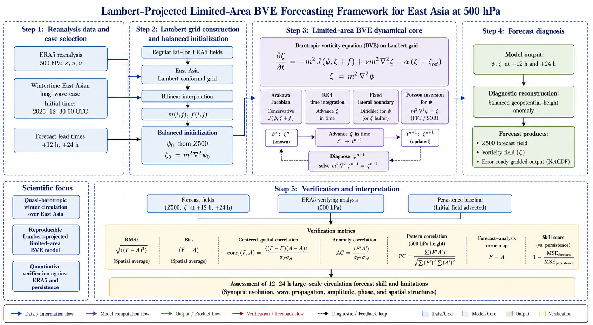

# Lambert BVE Forecast Experiment — Bonus Project Option 1

## 1. Overview

This project uses a finite-area barotropic vorticity equation (BVE) model on a
**Lambert conformal projection grid** to produce 12–24 h short-range forecasts
of a winter East Asian 500 hPa circulation pattern.

- Grid: Lambert conformal projection, regular image-plane grid.
- Prognostic variables: streamfunction `ψ` and relative vorticity `ζ`.
- Spatially varying map factor `m(i,j)` and Coriolis parameter `f(i,j)`.
- Poisson inversion: Dirichlet boundaries `ψ = 0`, solved via discrete sine
  transform.
- Verification metrics: height-anomaly RMSE, debiased RMSE, ACC, bias,
  vorticity correlation.

The workflow follows a standard forecast–verification cycle:

> ERA5 reanalysis → initial condition → numerical model → 12–24 h forecast
> → verification against ERA5 analysis

## 2. Case and Data

| Item | Value |
| --- | --- |
| Initial time | 2025-12-30 00 UTC |
| +12 h verification | 2025-12-30 12 UTC |
| +24 h verification | 2025-12-31 00 UTC |
| Pressure level | 500 hPa |
| Source domain | 15°N–65°N, 60°E–170°E |
| Verification subdomain | 25°N–55°N, 90°E–145°E |
| Lambert standard parallels | 25°N / 45°N |
| Lambert grid spacing | 150 km |

**Why 2025-12-30?** December is deep winter over East Asia. Baroclinic
energy conversion is weaker than in spring or autumn, so 500 hPa evolution
is more barotropically governed — a fair test for a single-level BVE model.
The pattern is slowly evolving (persistence ACC = 0.953 at +24 h), giving the
model room to show skill beyond trivial persistence without facing a rapidly
deepening cyclone that a non-divergent model cannot handle. The date also
falls at the end of the latest available full month of ERA5 data when the
project was run. Finally, late December features a well-developed East Asian
winter monsoon Rossby wave train, ideal for testing the model's large-scale
wave propagation skill.

**Data source:** ERA5 pressure-level reanalysis (Hersbach et al., 2020) at
500 hPa, 0.25° global grid, 6-hourly analysis fields. Required variables are
geopotential (`z`), u-wind (`u`), and v-wind (`v`).

## 3. Model

The governing equation is the barotropic vorticity equation on a Lambert
conformal projection plane:

$$
\begin{aligned}
\frac{\partial \zeta}{\partial t}
&= -m^2 J(\psi,\zeta+f) + \nu m^2\nabla^2\zeta - \alpha(\zeta-\zeta_0), \\[4pt]
\zeta &= m^2\nabla^2\psi .
\end{aligned}
$$

Here `m(i,j)` is the Lambert map factor and `f(i,j) = 2Ω sin φ` is the local
Coriolis parameter. The optional terms `ν` (vorticity diffusion) and `α`
(boundary sponge relaxation) are zero in the CTRL experiment and switched on
for sensitivity diagnosis only.

The model predicts vorticity and streamfunction. Forecast height anomaly is
diagnosed by the geostrophic relation

$$
Z' = \frac{f\psi}{g}.
$$

The model does not predict absolute domain-mean height; all height scores are
therefore based on height anomaly, bias, and debiased RMSE.

## 4. Numerical Configuration

- **Spatial discretisation:** second-order centred differences on a regular
  Lambert image-plane grid.
- **Jacobian:** Arakawa scheme (energy and enstrophy conserving).
- **Time integration:** fourth-order Runge–Kutta, `Δt = 600 s`.
- **Poisson solver:** discrete sine transform (DST) with Dirichlet boundary
  `ψ = 0` on all four sides.
- **Grid:** 54 × 34 points, `d = 150 km`, covering approximately
  56°E–174°E, 12°N–62°N.
- **Verification region:** 25°N–55°N, 90°E–145°E.

Optional sensitivity terms:

| Term | Symbol | CTRL value | Sensitivity value |
| --- | --- | --- | --- |
| Vorticity diffusion | `ν` | 0 | `2.5 × 10⁴ m² s⁻¹` |
| Boundary sponge | `α` | 0 | τ = 6 h over 8 boundary points |

## 5. How to Run

### Environment

```bash
conda env create -f bonus_project_option1_bve/environment.yml
conda activate bve-nwp
```

Core dependencies: NumPy, SciPy, xarray, netCDF4, Matplotlib, Cartopy.

### Data

ERA5 data can be downloaded from the
[Copernicus CDS](https://cds.climate.copernicus.eu/). Place the NetCDF file
(500 hPa geopotential, u, v; December 2025; 6-hourly; 0.25°) as
`bonus_project_option1_bve/data/raw/202512.nc`.

### Pipeline

```bash
# 1. Preprocess ERA5 to a regular lat-lon intermediate grid
python scripts/01_preprocess_local_data.py

# 2. Interpolate to the Lambert model grid
python scripts/02_prepare_lambert_grid.py

# 3. Run the Lambert BVE experiment matrix
python scripts/03_run_experiments.py

# 4. Generate verification figures
python scripts/04_make_figures.py

# 5. Numerical diagnostics (Poisson residual, energy, scale decomposition,
#    Δt sensitivity, Skill Score)
python scripts/05_diagnostics.py
```

## 6. Main Outputs

### Project structure



```
.
├── README.md
├── layout.png
├── cheatsheet_BP1.md
├── .gitignore
└── bonus_project_option1_bve/
    ├── environment.yml
    ├── .gitignore
    ├── data/
    │   ├── raw/                          # ERA5 .nc input (e.g. 202512.nc)
    │   ├── processed/                    # coarsened lat-lon .npz
    │   └── processed_lambert/            # Lambert-grid .npz
    ├── src/
    │   ├── bve_model_lambert.py          # Lambert BVE dynamical core
    │   ├── poisson_dirichlet.py          # DST Poisson solver (ψ = 0)
    │   ├── lambert_grid.py               # Lambert conformal grid builder
    │   ├── operators.py                  # centred differences + Arakawa Jacobian
    │   ├── interpolation.py              # bilinear interpolation
    │   ├── preprocess.py                 # ERA5 I/O, coarsening, variable detection
    │   ├── verification.py               # RMSE / ACC / bias / debiased RMSE
    │   └── plotting.py                   # curved-boundary Lambert maps + score plots
    ├── scripts/
    │   ├── 01_preprocess_local_data.py   # ERA5 → coarsened lat-lon .npz
    │   ├── 02_prepare_lambert_grid.py    # lat-lon → Lambert regrid
    │   ├── 03_run_experiments.py         # run 5 experiments
    │   ├── 04_make_figures.py            # verification figures
    │   └── 05_diagnostics.py             # numerical diagnostics
    ├── outputs/                          # forecast, verification, scores JSON
    ├── figures/                          # output .png files
    ├── note/
    │   └── technical_note.md             # technical note
    └── slides/
        └── slides_outline.md             # presentation outline
```

### Data and scores

| File | Content |
| --- | --- |
| `data/processed/*.npz` | ERA5 on the coarsened lat-lon grid |
| `data/processed_lambert/*.npz` | Fields interpolated to the Lambert model grid |
| `data/processed_lambert/grid_info_lambert.npz` | Lambert grid, `m(i,j)`, `f(i,j)` |
| `outputs/*_LCC_forecast_*.npz` | Forecast `ψ, ζ` for each experiment |
| `outputs/*_LCC_verification_*.npz` | Verification arrays for each experiment |
| `outputs/scores_experiment_matrix.json` | Experiment scores |
| `outputs/diagnostics.json` | Diagnostics (Poisson residual, energy, scale, Δt, SS) |

### Figures

| File | Content |
| --- | --- |
| `figures/fig13_lambert_ctrl_verification_12h.png` | CTRL +12 h forecast / analysis / error maps |
| `figures/fig13_lambert_ctrl_verification_24h.png` | CTRL +24 h forecast / analysis / error maps |
| `figures/fig14_lambert_experiment_scores.png` | Experiment score comparison |
| `figures/fig15_lambert_impact_summary.png` | Experiment impact summary |

### A note on display maps

Maps use a curved Lambert boundary defined by `set_lambert_curved_boundary()`
in `src/plotting.py` and are clipped to the source-domain footprint.
For visual consistency with the report, the Lambert forecast field is
interpolated to the original lat-lon display grid and smoothly tapered near
the model boundary. This display interpolation does **not** affect the
quantitative scores — all verification uses the native Lambert model grid.

## 7. Main Results

All scores are computed on the verification subdomain (25°N–55°N, 90°E–145°E).

| Experiment | Lead | RMSE (m) | Debiased RMSE (m) | Bias (m) | ACC |
| --- | --- | ---: | ---: | ---: | ---: |
| PERSIST_LCC | +12 h | 42.9 | 41.4 | −11.1 | 0.985 |
| PERSIST_LCC | +24 h | 70.3 | 69.2 | −12.5 | 0.953 |
| CTRL_LCC | +12 h | 55.4 | 54.1 | +12.1 | 0.975 |
| CTRL_LCC | +24 h | 56.6 | 55.7 | +10.0 | 0.963 |
| DIFF_LCC | +12 h | 55.9 | 55.1 | +9.7 | 0.973 |
| DIFF_LCC | +24 h | 57.9 | 57.9 | −1.0 | 0.960 |
| SPONGE_LCC | +12 h | 50.8 | 50.7 | +2.6 | 0.980 |
| SPONGE_LCC | +24 h | 69.0 | 69.0 | +1.6 | 0.960 |
| DIFF_SPONGE_LCC | +12 h | 52.2 | 52.1 | +1.4 | 0.978 |
| DIFF_SPONGE_LCC | +24 h | 71.9 | 71.8 | −1.7 | 0.956 |

**Interpretation.** The case is highly persistent: PERSIST_LCC already
achieves +24 h ACC of 0.953. At +12 h, persistence gives the lowest RMSE,
indicating the true atmospheric evolution is still small. At +24 h, CTRL_LCC
improves RMSE from 70.3 m to 56.6 m and ACC from 0.953 to 0.963, suggesting
useful large-scale phase-evolution skill. Diffusion and sponge experiments
(DIFF_LCC, SPONGE_LCC, DIFF_SPONGE_LCC) are sensitivity diagnostics; they do
not further reduce +24 h RMSE, confirming that the Dirichlet boundary
configuration is already numerically stable for 24 h forecasts.

## 8. Diagnostics

`scripts/05_diagnostics.py` performs five additional checks of numerical
reliability:

| Diagnostic | Result |
| --- | --- |
| Poisson solver residual | ‖m²∇²ψ − ζ‖₂ / ‖ζ‖₂ = **1.7 × 10⁻¹⁵** (machine precision) |
| Kinetic energy 24 h drift | **+10.8%** (bounded, no blow-up) |
| Enstrophy 24 h drift | **+12.2%** (bounded, no blow-up) |
| Large-scale ACC (+24 h, σ = 2.0 Gaussian) | **0.967** (exceeds full-field ACC 0.963) |
| Small-scale ACC (+24 h) | 0.741 (BVE has limited small-scale skill, as expected) |
| Δt sensitivity (300 / 600 / 900 s) | +24 h RMSE identical at **56.6 m** for all three |
| Skill Score vs PERSIST (+12 h) | SS = **−0.29** (persistence wins at short lead) |
| Skill Score vs PERSIST (+24 h) | SS = **+0.195** (~20% RMSE reduction vs persistence) |

These confirm: (1) the Poisson inversion is reliable to machine precision;
(2) the nonlinear integration is numerically stable over 24 h;
(3) BVE skill is concentrated at large scales (Rossby waves), consistent
with barotropic dynamics; (4) conclusions are insensitive to time-step
choice; (5) CTRL_LCC shows positive skill over persistence at +24 h, while
persistence remains stronger at +12 h — consistent with a slowly evolving
winter circulation.

## 9. Limitations

1. **Single-level barotropic model.** No divergence, vertical structure, or
   baroclinic processes.
2. **Diagnostic height recovery.** The current `Z' = fψ/g` is a first-order
   geostrophic height-anomaly approximation. It is simpler than solving the
   linear balance equation, so the reported height scores should be
   interpreted as balanced anomaly scores rather than full geopotential-height
   verification.
3. **Fixed Dirichlet boundaries.** `ψ = 0` on all sides eliminates
   wrap-around issues but does not provide time-dependent lateral forcing.
4. **Single case.** Results are not statistically representative of model
   performance across all weather regimes.
5. **Display interpolation is separate from scoring.** Figure 13
   interpolates to a lat-lon display grid with edge tapering for visual
   consistency; quantitative scores use the native Lambert model grid.

## Individual Contributions

This project was completed by a two-person group. The work was divided by
major technical components while both members participated in the overall
design, interpretation, and final revision.

| Member | Main Contributions |
| --- | --- |
| Yutian Qi (231170026) | Took primary responsibility for the Lambert finite-area BVE model implementation, including the model-equation formulation, Arakawa Jacobian, RK4 time integration, DST-based Poisson inversion, boundary-condition treatment, and numerical-stability diagnostics. Also contributed to the experimental design, result analysis, and the interpretation of dynamical results. |
| Yuncan Xiao (231170016) | Took primary responsibility for ERA5 data preprocessing, Lambert-grid construction, interpolation from latitude-longitude data to the model grid, forecast verification against ERA5 analyses, figure generation, score organization, and documentation preparation. Also contributed to the selection of the East Asian winter case and final presentation materials. |

Both members contributed to debugging, checking the reproducibility of the
workflow, comparing the forecast with the persistence baseline, discussing
model limitations, and revising the final README, technical note, and
slides.

## 10. References

- Arakawa, A. (1966). Computational design for long-term numerical
  integration of the equations of fluid motion. *J. Comput. Phys.*, 1,
  119–143.
- Haltiner, G. J., and R. T. Williams (1980). *Numerical Prediction and
  Dynamic Meteorology*, 2nd ed., Wiley.
- Hersbach, H., et al. (2020). The ERA5 global reanalysis. *Quart. J. Roy.
  Meteorol. Soc.*, 146, 1999–2049.
- Holton, J. R., and G. J. Hakim (2013). *An Introduction to Dynamic
  Meteorology*, 5th ed., Academic Press.

See also: **[cheatsheet_BP1.md](cheatsheet_BP1.md)** — course formula and
numerical-method reference covering BPE, BVE, and shallow-water models.
