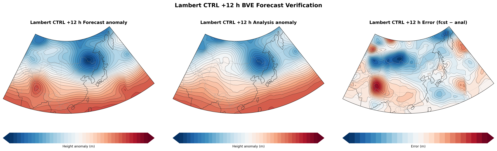
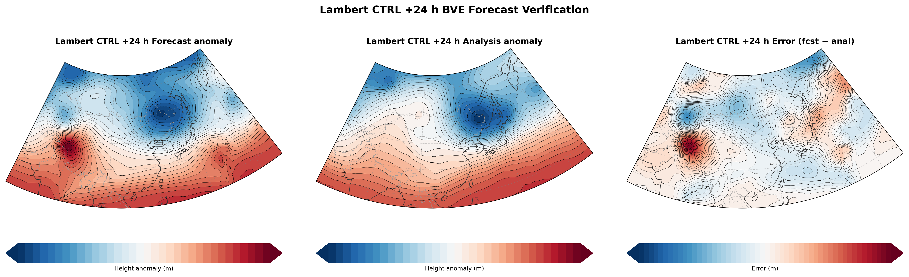

# Technical Note: Lambert Finite-Area 500 hPa BVE Forecast

**Bonus Project Option 1 — Numerical Weather Prediction Course**

---

## 1. Case and Data

The case is a winter East Asian 500 hPa circulation pattern initialized at
2025-12-30 00 UTC. ERA5 pressure-level reanalysis (Hersbach et al., 2020)
provides the initial condition and verifying analyses. Three times are used:

- 2025-12-30 00 UTC — initial condition
- 2025-12-30 12 UTC — +12 h verifying analysis
- 2025-12-31 00 UTC — +24 h verifying analysis

The raw ERA5 fields (geopotential `z`, u-wind `u`, v-wind `v`; 0.25° global;
6-hourly) are subset to 15°N–65°N, 60°E–170°E and coarsened to approximately
1° resolution. Geopotential is converted to geopotential height by
`Z = Φ/g`.

**Why this case.** December is deep winter over East Asia. Baroclinic
energy conversion is weaker than in transitional seasons, so 500 hPa
evolution is more barotropically governed — a fair test for a single-level
BVE model. The pattern is slowly evolving (persistence ACC = 0.953 at
+24 h), which gives the model room to show skill beyond trivial persistence
without facing a rapidly deepening system that a non-divergent model cannot
handle.

---

## 2. Model Equation and Assumptions

The governing equation is the barotropic vorticity equation (BVE) on a
Lambert conformal projection plane:

$$
\begin{aligned}
\frac{\partial \zeta}{\partial t}
&= -m^2 J(\psi,\zeta+f) + \nu m^2\nabla^2\zeta - \alpha(\zeta-\zeta_0), \\[4pt]
\zeta &= m^2\nabla^2\psi .
\end{aligned}
$$

Here `ψ` is streamfunction, `ζ` is relative vorticity, `m(i,j)` is the
Lambert map factor, and `f(i,j) = 2Ω sin φ` is the local Coriolis parameter
evaluated on the model grid. The optional terms `ν` (Laplacian vorticity
diffusion) and `α` (boundary sponge relaxation) are zero in the CTRL
experiment and switched on only for sensitivity diagnosis.

**Key assumptions:**

- Non-divergent, barotropic flow on a single pressure level (500 hPa).
- Lambert conformal projection (angle-preserving; suitable for
  mid-latitude limited-area modelling).
- Fixed lateral boundaries with `ψ = 0` (Dirichlet); no time-dependent
  boundary forcing.
- No diabatic heating, friction, or orographic forcing (except explicit
  sensitivity terms `ν` and `α`).

---

## 3. Lambert Grid and Initial Condition

### 3.1 Grid

The Lambert conformal grid is generated by `src/lambert_grid.py`.

| Quantity | Value |
| --- | --- |
| Projection | Lambert conformal |
| Standard parallels | 25°N / 45°N |
| Grid spacing | 150 km |
| Grid size | 54 × 34 |
| Approximate coverage | 56°E–174°E, 12°N–62°N |
| Verification subdomain | 25°N–55°N, 90°E–145°E |

ERA5 fields are first processed on a regular latitude-longitude grid
(script `01_preprocess_local_data.py`) and then bilinearly interpolated to
the Lambert model grid by script `02_prepare_lambert_grid.py`.

### 3.2 Initial Condition

The initial streamfunction is diagnosed from the height anomaly using a
variable-`f` geostrophic relation:

$$
\psi_0 = \frac{g(Z_0-\overline{Z_0})}{f}.
$$

The boundary value of `ψ` is set to zero to match the Dirichlet Poisson
solver. Initial vorticity is then computed as

$$
\zeta_0 = m^2\nabla^2\psi_0.
$$

### 3.3 Poisson Solver

The inversion

$$
\nabla^2\psi = \frac{\zeta}{m^2}
$$

is solved with `ψ = 0` on all four boundaries. The implementation uses a
discrete sine transform (DST) built with NumPy FFTs in
`src/poisson_dirichlet.py`. This avoids the doubly-periodic assumption of a
standard FFT Poisson solver and is appropriate for the Dirichlet
finite-area configuration.

**Figure 1.** CTRL_LCC +12 h balanced 500 hPa height-anomaly forecast, ERA5
verifying analysis, and forecast error on the Lambert model grid. This is the
earliest forecast snapshot available and reflects the evolution from the
initial condition at 2025-12-30 00 UTC. The balanced anomaly is diagnosed
from ERA5 geopotential and used to initialise the BVE model.

---

## 4. Numerical Method

- **Spatial derivatives:** second-order centred differences on a regular
  Lambert image-plane grid.
- **Jacobian:** Arakawa scheme, which conserves both kinetic energy and
  enstrophy in the advection of vorticity by the non-divergent wind.
- **Time integration:** fourth-order Runge–Kutta with `Δt = 600 s`.
- **Diffusion:** optional Laplacian vorticity diffusion with
  `ν = 2.5 × 10⁴ m² s⁻¹` (DIFF experiments only).
- **Sponge:** optional boundary relaxation of vorticity toward the initial
  vorticity over the outermost 8 grid points with a time scale of
  `τ = 6 h` (SPONGE experiments only).

---

## 5. Height Recovery and Verification Metrics

The model predicts vorticity and streamfunction, not absolute geopotential
height. Forecast height anomaly is diagnosed by the geostrophic relation

$$
Z'_\mathrm{fcst} = \frac{f\psi_\mathrm{fcst}}{g}.
$$

> **Caveat.** The `Z' = fψ/g` diagnostic is a first-order geostrophic
> height-anomaly approximation. It is simpler than solving the linear
> balance equation, so the reported height scores should be interpreted as
> balanced anomaly scores rather than full geopotential-height verification.

Because the model does not predict absolute domain-mean height, full-field
RMSE is not reported. Verification focuses on:

| Metric | Definition |
| --- | --- |
| Height anomaly RMSE | RMSE of `Z'_fcst − Z'_anal` |
| Height debiased RMSE | RMSE after removing mean forecast−analysis bias |
| Height ACC | Spatial anomaly correlation coefficient |
| Height bias | Mean forecast−analysis height anomaly difference |
| Vorticity correlation | Spatial correlation of forecast and analysis vorticity |

All scores are computed on the inner verification subdomain
25°N–55°N, 90°E–145°E.

---

## 6. Forecast Results

The experiment matrix is run by `scripts/03_run_experiments.py`.

| Experiment | Description |
| --- | --- |
| PERSIST_LCC | Persistence baseline: initial height anomaly held constant |
| CTRL_LCC | Lambert BVE without diffusion or sponge |
| DIFF_LCC | Lambert BVE + Laplacian vorticity diffusion |
| SPONGE_LCC | Lambert BVE + lateral boundary sponge relaxation |
| DIFF_SPONGE_LCC | Lambert BVE + diffusion + sponge |

### 6.1 Verification Scores

| Experiment | Lead | RMSE (m) | Debiased RMSE (m) | Bias (m) | ACC |
| --- | --- | ---: | ---: | ---: | ---: |
| PERSIST_LCC | +12 h | 42.9 | 41.4 | −11.1 | 0.985 |
| PERSIST_LCC | +24 h | 70.3 | 69.2 | −12.5 | 0.953 |
| CTRL_LCC | +12 h | 55.4 | 54.1 | +12.1 | 0.975 |
| CTRL_LCC | +24 h | 56.6 | 55.7 | +10.0 | 0.963 |
| DIFF_LCC | +12 h | 55.9 | 55.1 | +9.7 | 0.973 |
| DIFF_LCC | +24 h | 57.9 | 57.9 | −1.0 | 0.960 |
| SPONGE_LCC | +12 h | 50.8 | 50.7 | +2.6 | 0.980 |
| SPONGE_LCC | +24 h | 69.0 | 69.0 | +1.6 | 0.960 |
| DIFF_SPONGE_LCC | +12 h | 52.2 | 52.1 | +1.4 | 0.978 |
| DIFF_SPONGE_LCC | +24 h | 71.9 | 71.8 | −1.7 | 0.956 |

**Figure 2.** CTRL_LCC +24 h balanced height-anomaly forecast, ERA5 verifying
analysis, and forecast error. The +24 h CTRL run reduces RMSE from 70.3 m in
persistence to 56.6 m and improves ACC from 0.953 to 0.963, demonstrating
useful large-scale phase-evolution skill over a purely persistent baseline.

### 6.2 Interpretation

The case is highly persistent. At +12 h, persistence gives the lowest RMSE
(42.9 m), indicating that the true atmospheric evolution is still small. At
+24 h, CTRL_LCC improves RMSE from 70.3 m to 56.6 m and ACC from 0.953 to
0.963, suggesting useful large-scale phase-evolution skill.

The diffusion and sponge experiments (DIFF_LCC, SPONGE_LCC,
DIFF_SPONGE_LCC) are **diagnostic sensitivity runs**, not tuned
configurations expected to improve the forecast. They confirm that:

- Adding weak vorticity diffusion leaves the solution nearly unchanged at
  +24 h, consistent with a numerically stable control integration.
- Boundary sponge relaxation reduces +12 h RMSE but degrades +24 h RMSE,
  suggesting it damps physically meaningful boundary Rossby wave
  propagation over longer leads.
- The Dirichlet boundary configuration is already stable for 24 h forecasts
  without explicit numerical damping.

---

## 7. Numerical Diagnostics

`scripts/05_diagnostics.py` performs five additional checks:

| Diagnostic | Result |
| --- | --- |
| Poisson solver residual | ‖m²∇²ψ − ζ‖₂ / ‖ζ‖₂ = 1.7 × 10⁻¹⁵ (machine precision) |
| Kinetic energy drift (24 h) | +10.8% (bounded, no oscillation or blow-up) |
| Enstrophy drift (24 h) | +12.2% (bounded, no oscillation or blow-up) |
| Large-scale ACC (+24 h, σ = 2.0) | 0.967 (exceeds full-field ACC of 0.963) |
| Small-scale ACC (+24 h) | 0.741 (limited small-scale skill, physically expected) |
| Δt sensitivity (300 / 600 / 900 s) | +24 h RMSE = 56.6 m for all three step sizes |
| Skill Score vs PERSIST (+12 h) | SS = −0.29 (persistence is better at short lead) |
| Skill Score vs PERSIST (+24 h) | SS = +0.195 (CTRL reduces RMSE ~20% vs persistence) |

These confirm that (i) the Poisson inversion is reliable to machine
precision, (ii) the nonlinear integration is numerically stable over the
24 h window, (iii) the model's skill is concentrated at large scales
consistent with Rossby wave dynamics, and (iv) the main conclusions are
insensitive to time-step choice.

---

## 8. Limitations

1. **Single-level, non-divergent dynamics.** The BVE cannot represent
   baroclinic development, vertical motion, latent heating, or
   boundary-layer processes.
2. **Diagnostic height recovery.** `Z' = fψ/g` is a first-order
   geostrophic height-anomaly approximation. A more rigorous treatment
   would solve the linear balance equation. The reported height scores
   should be interpreted as balanced anomaly scores.
3. **Idealised fixed boundaries.** `ψ = 0` on all sides provides a clean
   Dirichlet condition but does not supply time-dependent lateral forcing,
   which a real limited-area model would require.
4. **Single case study.** Results are not statistically representative of
   model performance across different weather regimes.
5. **Display interpolation is separate from scoring.** The Lambert forecast
   field shown in the figures is interpolated to a lat-lon display grid and
   smoothly tapered near the model boundary for visual consistency. This
   processing does not affect the quantitative scores, which are computed on
   the native Lambert model grid.

---

## 9. Conclusion

A finite-area barotropic vorticity equation model on a Lambert conformal
projection grid was applied to a winter East Asian 500 hPa case
(2025-12-30 00 UTC). The model integrates `ζ` and `ψ` with an Arakawa
Jacobian, fourth-order Runge–Kutta time stepping, and a DST Poisson solver
with Dirichlet boundaries.

At +24 h, CTRL_LCC improves RMSE and ACC over persistence (RMSE 56.6 m
vs 70.3 m; ACC 0.963 vs 0.953), demonstrating that the BVE extracts useful
large-scale phase-evolution information from the initial condition. The
improvement is modest but physically meaningful for a single-level,
non-divergent model applied to a slowly evolving winter case. Vorticity
diffusion and boundary sponge relaxation were examined as diagnostic
sensitivity experiments; neither further reduces +24 h RMSE, confirming
that the Dirichlet boundary configuration is numerically stable for 24 h
forecasts without explicit numerical damping.

---

## Individual Contributions

This project was completed by a two-person group. Yutian Qi (231170026) was
mainly responsible for the Lambert finite-area BVE model implementation,
including the model formulation, Arakawa Jacobian, RK4 integration,
DST-based Poisson inversion, boundary-condition treatment, and numerical
diagnostics, and contributed to the experimental design and interpretation
of dynamical results. Yuncan Xiao (231170016) was mainly responsible for
ERA5 preprocessing, Lambert-grid construction, regridding, forecast
verification, figure generation, score organization, and documentation
preparation, and contributed to the selection of the East Asian winter case.

Both members contributed to debugging, result analysis, discussion of model
limitations, comparison with the persistence baseline, and final revision of
the README, technical note, and slides.

---

## References

- Arakawa, A. (1966). Computational design for long-term numerical
  integration of the equations of fluid motion. *J. Comput. Phys.*, 1,
  119–143.
- Haltiner, G. J., and R. T. Williams (1980). *Numerical Prediction and
  Dynamic Meteorology*, 2nd ed., Wiley.
- Hersbach, H., et al. (2020). The ERA5 global reanalysis. *Quart. J. Roy.
  Meteorol. Soc.*, 146, 1999–2049.
- Holton, J. R., and G. J. Hakim (2013). *An Introduction to Dynamic
  Meteorology*, 5th ed., Academic Press.
